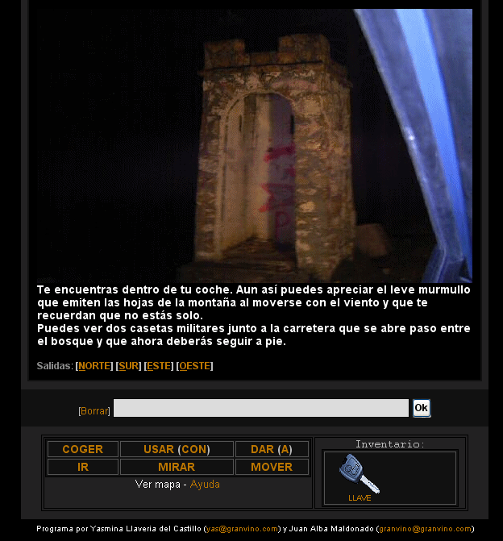

La villa del seis (aka La villa del 6)
====================================== 
by Yasmina Llaveria del Castillo and Joan Alba Maldonado (joanalbamaldonadoNO_SPAM_PLEASE AT gmail DOT com, without NO_SPAM_PLEASE)

A terror adventure. Combination of graphical point-and-click adventure and text adventure totally written in PHP and DHTML.

Version: 1.0 
- Date: 16th September 2006 (approximately).

You can donate at http://sourceforge.net/donate/index.php?group_id=177819

## Description

Open source adventure game written in PHP, HTML, CSS and JavaScript.

This game was made in late 2006 and uses the engine of [Yasmina's Quest](https://github.com/jalbam/yquest) that I made before, modified and improved. It was made together with Yasminan Llaveria del Castillo and some of the photos used were taken by Esteban Villegas Gallego.

Official languages are Spanish and Catalan.

It has become quite famous on the Internet, with thousands and thousands of downloads and online players. It was even mentioned in at least one well-known Spanish magazine called "[Año/Cero](http://www.revistaañocero.com/)" in an article titled "[La ruta de los pueblos condenados](http://www.revistaañocero.com/secciones/geografia-magica/ruta-pueblos-condenados)" written by José Manuel Serrano Cueto and published in January 2007 (on paper as well as on-line).

Since this has the [Yasmina's Quest](https://github.com/jalbam/yquest) engine but improved, some people has chosen the code of this game to create their adventure instead of using the [Yasmina's Quest](https://github.com/jalbam/yquest) code. As well as [Yasmina's Quest](https://github.com/jalbam/yquest), the game can be played either as a point-and-click adventure or as a text adventure and it can run in any kind of web browser. JavaScript and CSS are useful but not really necessary. Images are not necessary either, allowing the game to be played in a text-based web browser as Lynx or Links.

This game has been tested under BeOS, Linux, NetBSD, OpenBSD, FreeBSD, Windows, Mac OS X, QNX, BlackBerry Tablet OS, Android, iOS and others. In its homepage you can see some screenshots with the game running on many different platforms such as Nintendo DS, Sony PSP, Sega Dreamcast and Pocket PC.

Recently (27 September 2018), a new package using [php-webkit](https://github.com/baconbrad/php-webkit) was added so it can be played offline on Windows XP with SP2 (Service Pack 2) and newer (including Windows 10). Just download the *[la_villa_del_seis_php-webkit_win32.zip](la_villa_del_seis_php-webkit_win32.zip)* or the *[la_villa_del_seis_php-webkit_win32.7z](la_villa_del_seis_php-webkit_win32.7z)* file. The *[la_villa_del_seis_php-webkit_win32_installer.exe](la_villa_del_seis_php-webkit_win32_installer.exe)* file also provides an installer for the same package. Porting the same package to other operating systems and platforms should not be too difficult. For some older Windows versions (older than Windows XP with SP2), the *[la_villa_del_seis_on_server2go.zip](la_villa_del_seis_on_server2go.zip)* file provides an older package which uses [Server2Go](https://sourceforge.net/projects/server2go/).

Play online in Spanish: http://lavilladel6.tuxfamily.org/lavilladel6_spanish/

Play online in Spanish (mirror): http://www.dhtmlgames.com/lavilladel6/lavilladel6_spanish/

Play online in Catalan: http://lavilladel6.tuxfamily.org/lavilladel6_catalan/

Play online in Catalan (mirror): http://www.dhtmlgames.com/lavilladel6/lavilladel6_catalan/

Official web site: http://lavilladel6.tuxfamily.org/ (mirror at http://www.dhtmlgames.com/lavilladel6/).

## License

This project can be used, reproduced, distributed and modified freely for any non-commercial purposes but always keeping the authors' name and copyright clauses. Other than that, just use this project as you wish but never sell it!